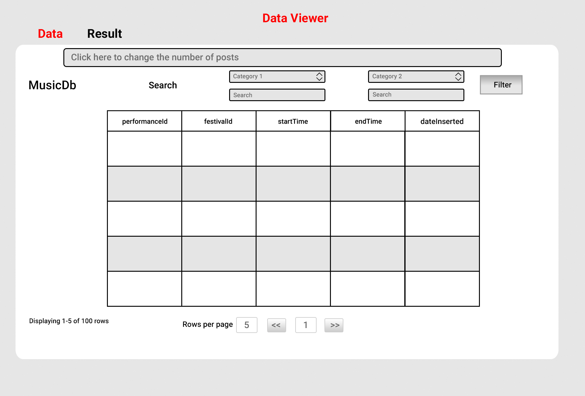
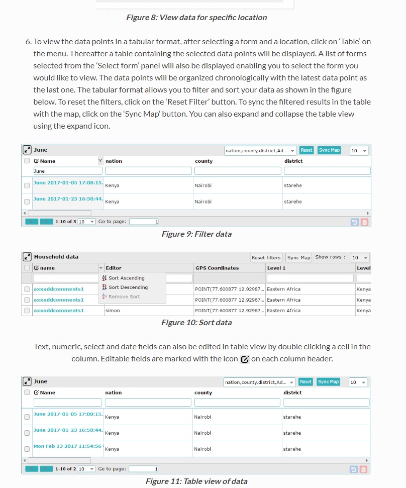
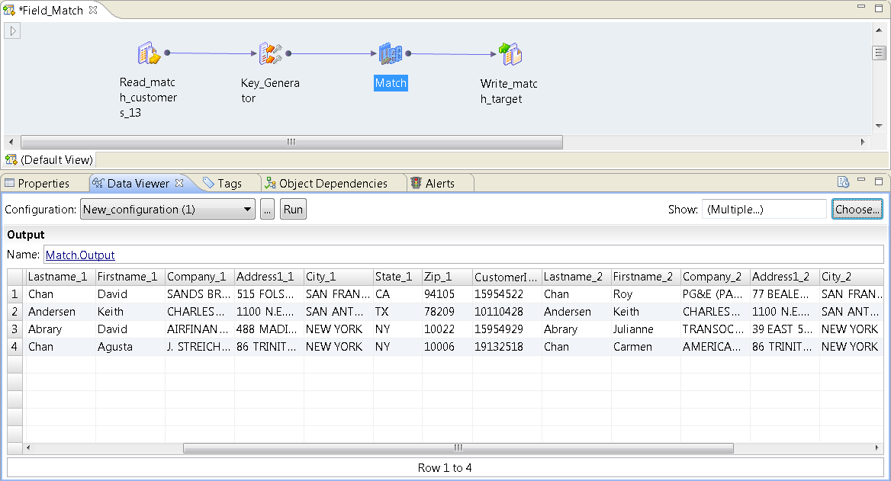

# Wireframe & Justification

## Wireframe

1. Attributes shown at top and bottom can be useful for big table.
2. Showing total number of entries can be useful for some instance.
3. Pagination tool meets requirement
4. Able to search by 2 different categories or one at a the same time.
5. Page scalable to the number possible posts per page.

## Justifications

### Justification 1

We decided to take reference from this dataViewer since it was presentable and easy to understand.

#### Good Points

1. Nice looking UI.
2. Shows the total number of entries in that database.
3. Pagination tool meets requirement.

#### Bad Points

1. May need more search bars to meet requirements.

### Justification 2

This dataviewer looks like a dataviewer for an important company with the way that is designed and has pros and cons to it.

#### Good Points

1. Has many search bars which meets requirement.
2. Has pagination.
3. Has a search bar in the pagination
4. Very easily understood.

#### Bad Points

1. Bad looking UI.
2. Information looks very cramped on the screen.
3. Might be problematic for many columns

### Justification 3

This dataviewer looks very plain but it shows how to show the data if there are many columns.

#### Good Points

1. Shows on how to alter to many tables.
4. Very easily understood.

#### Bad Points

1. Bad looking UI.
2. Information looks very cramped on the screen.
3. Might be problematic for many columns
4. Does not have pagination