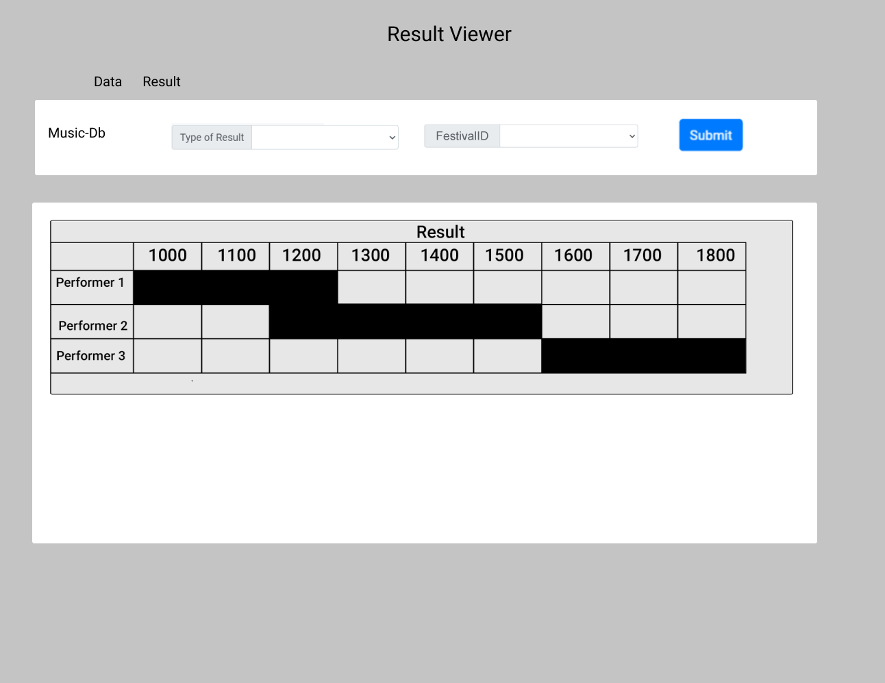
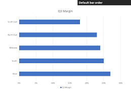
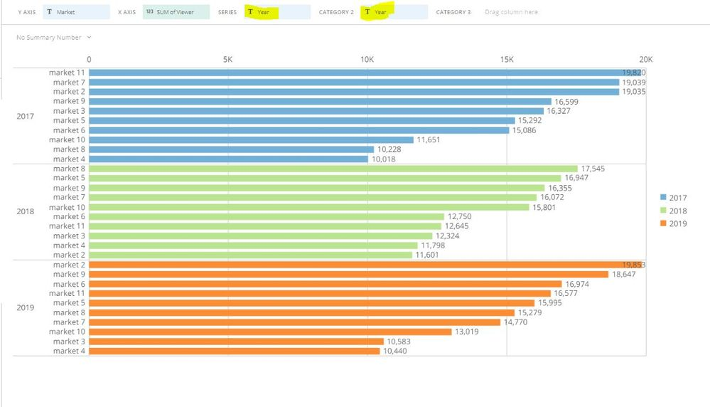
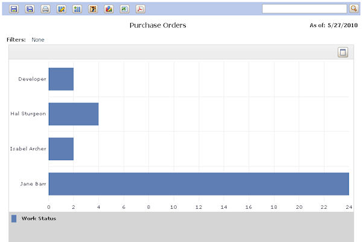

# Wireframe & Justification

## Wireframe

1. Able to fit all the information in the same page.
2. Able to display all the performances correctly.
3. Very easily understood.
4. Easy to insert data from the input boxes at the top.

## Justifications

### Justification 1

We decided to take reference from this image which shows a bar graph.

#### Good Points

1. Nice looking UI.
2. Shows all the information in the same page.
3. Very easily understood.

#### Bad Points

1. May need more search bars to meet requirements.
2. No Input box.

We decided to take reference from this image which shows a bar graph.

#### Good Points

1. Nice looking UI.
2. Shows all the information in the same page.
3. Very easily understood.
4. Has input boxes at the top.

#### Bad Points

1. Information looks very cramped.

We decided to take reference from this image which shows a bar graph.

#### Good Points

1. Nice looking UI.
2. Shows all the information in the same page.
3. Very easily understood.
4. Has filtering at the top.

#### Bad Points

1. Bad UI design.

