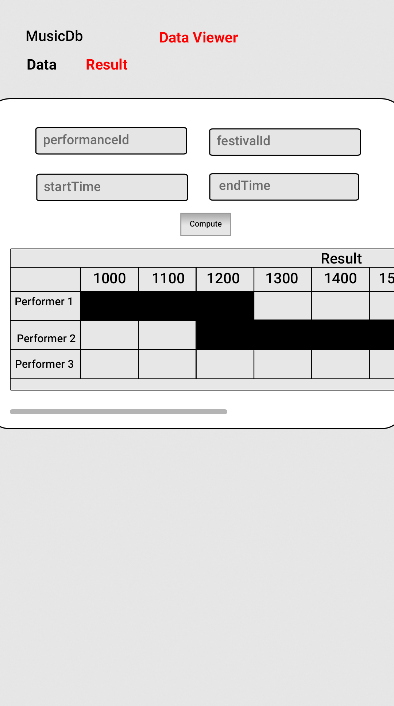
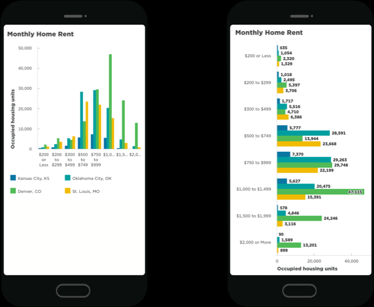
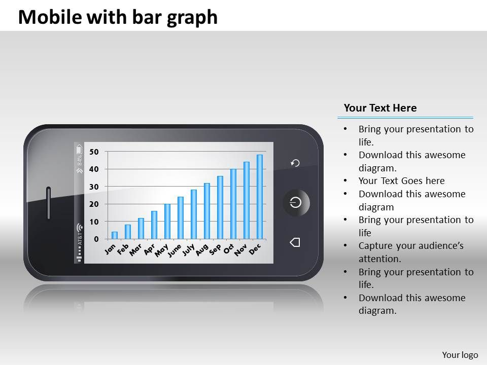
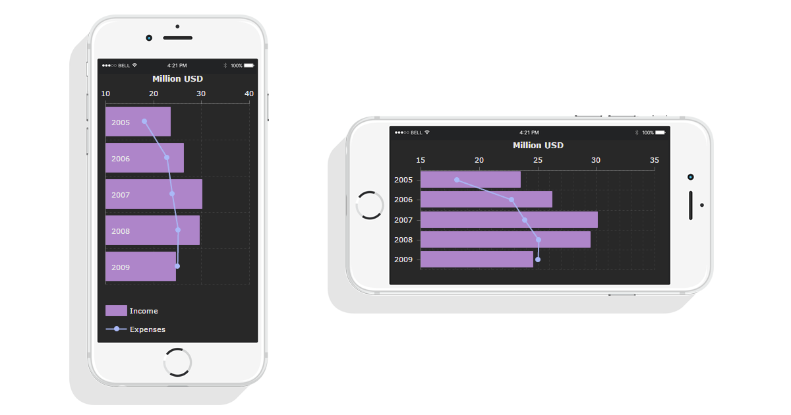

# Wireframe & Justification

## Wireframe

1. Able to fit all the information in the same page.
2. Able to display all the performances correctly.
3. Able to see the time just by scrolling to the right.

## Justifications

### Justification 1

We decided to take reference from this image which shows a bar graph.

#### Good Points

1. Nice looking UI.
2. Shows all the information in the same page.

#### Bad Points

1. May need more search bars to meet requirements.
2. No Input box.
3. Information looks very cramped.

### Justification 2

This resultViewer shows a table with all of the column headers being rows. It is one way to be a data viewer.

#### Good Points

1. Able to show all the bar chart easily on the screen without need to scroll.
2. Easy to understand.

#### Bad Points

1. Requires the user to tilt the phone.
2. No Input box.
3. No Compute boxes
4. Columns is for information not header.

### Justification 3

This resultViewer is able to show the information clearly and can be readjusted by tilting the phone.

#### Good Points

1. Good UI design.
2. Information is presented clearly.
3. Able to adjust to phone size or tilting the phone.

#### Bad Points

1. No Input boxes.
2. No compute boxes.