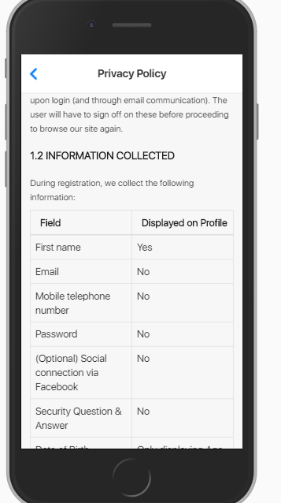

# Wireframe & Justification

## Wireframe

1. Attributes shown at top and bottom can be useful for big table.
2. Showing total number of entries can be useful for some instance.
3. Pagination tool meets requirement.
4. Able to search by 2 different categories or one at a the same time.
5. Page scalable to the number possible posts per page.
6. Page scrollable since its a phone.

## Justifications

### Justification 1

We decided to take reference from this dataViewer since it was presentable and easy to understand.

#### Good Points

1. Nice looking UI.
2. Shows the total number of entries in that database.
3. Pagination tool meets requirement.

#### Bad Points

1. May need more search bars to meet requirements.

### Justification 2

This dataviewer shows a table with all of the column headers being rows. It is one way to be a data viewer.

#### Good Points

1. Shows on how to alter a table with 2 rows.
2. All of the information can be seen with just a scroll.
3. Very easily understood.

#### Bad Points

1. Information looks very cramped on the screen.
2. Might be problematic for many columns.
3. Does not have pagination.
4. Does not have any search bar.

### Justification 3

This dataviewer one way to view data by having the column name in the first page and when you click on it, it brings you to another page.

#### Good Points

1. Shows on how to alter to many tables.
2. Very easily understood.
3. Good looking UI.

#### Bad Points

1. Hard to show all the information in one page.
2. Information looks very cramped on the screen.
3. Might be problematic for many columns
4. Does not have pagination.
5. Information can only be seen by clicking on theri individual icon.